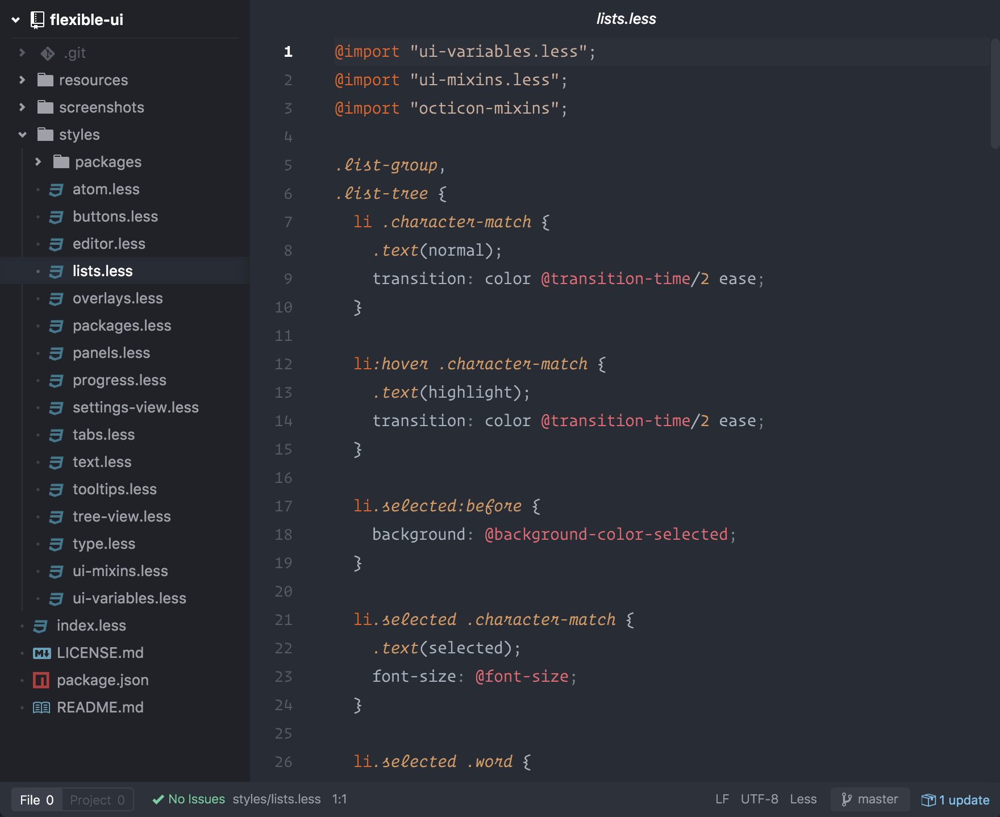
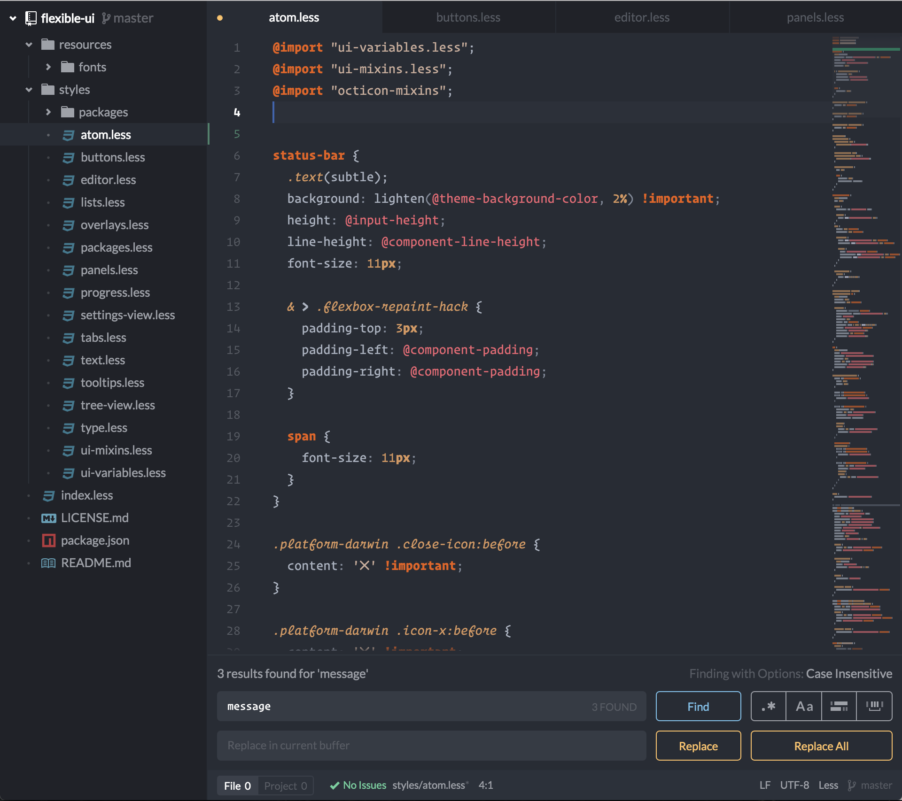
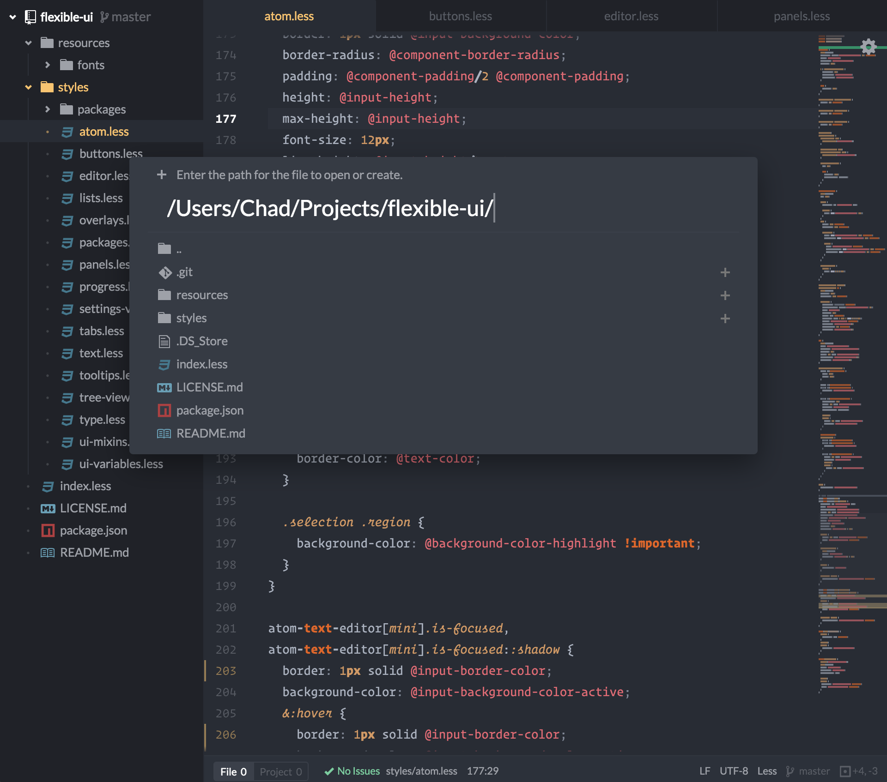
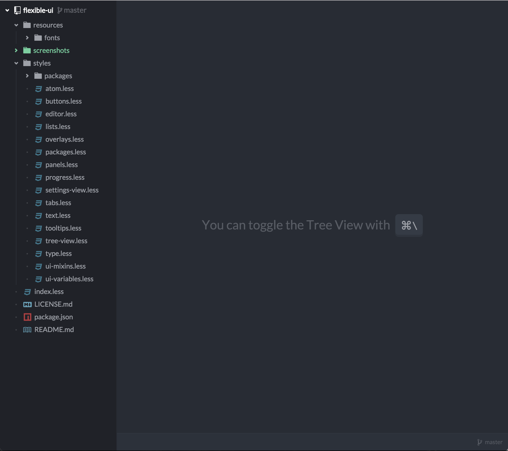

# Flexible UI

Flexible is an adaptable UI theme for Atom that is based off of [Nucleus Dark UI](https://github.com/ignism/nucleus-dark-ui)

> Shown here with the [Firewatch](https://atom.io/themes/firewatch-syntax) theme

#### Features
- Improved file drawer using scope lines and file indicators
- Use of the [Lato](https://www.google.com/fonts/specimen/Lato) typeface for readability
- Improved contrast, padding, and margins

#### More screenshots
###### Searching
 
###### Create/Open File
 
###### Helper Messages

#### Installation
Go to settings within Atom, select Install and search for Flexible under themes.

Or install directly from the console:

`apm install flexible-ui`
